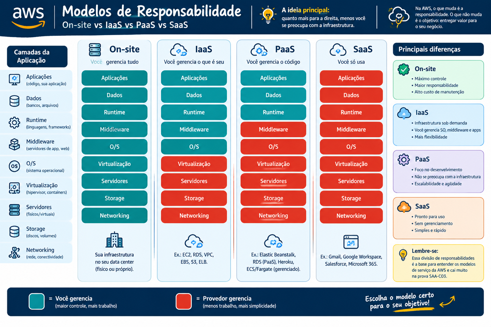

# ☁️ Cloud Computing - Aula 01: Introdução e Paradigma Tradicional

> 💡 **Foco SAA-C03:** Embora a prova foque em arquitetura técnica, os conceitos fundamentais de "por que ir para a nuvem" baseiam muitas questões, principalmente no que diz respeito à troca de **CapEx** por **OpEx**.

## 🏢 1. Como era antes da Nuvem? (Modelo On-Premises Tradicional)
Antes da computação em nuvem, as empresas precisavam construir e manter seus próprios Data Centers locais (On-Premises). Isso trazia grandes desafios:

* **Altos Custos Iniciais (CapEx - Capital Expenditure):** Era necessário gastar milhões antecipadamente comprando servidores físicos, racks, switches e cabos antes mesmo do projeto começar a dar lucro.
* **Adivinhação de Capacidade (Guessing Capacity):** Você tinha que prever o tráfego máximo (ex: Black Friday). Se comprasse servidores de menos, o site caía. Se comprasse a mais, eles ficavam ociosos acumulando poeira no resto do ano, desperdiçando dinheiro.
* **Ciclos de Inovação Lentos:** Comprar, importar, instalar e configurar um novo servidor físico podia levar semanas ou meses, travando a agilidade dos desenvolvedores.
* **Manutenção Pesada (Undifferentiated Heavy Lifting):** A equipe de TI gastava muito tempo e dinheiro com energia elétrica, resfriamento físico (ar-condicionado), segurança do prédio e troca de discos queimados, em vez de focar no software em si.

---

## 🌩️ 2. O que é Cloud Computing? (A Solução)
**Definição AWS:** É a entrega sob demanda de poder computacional, banco de dados, armazenamento, aplicações e outros recursos de TI por meio da internet, com um modelo de preço pago conforme o uso (*Pay-as-you-go*).

Basicamente, você aluga os computadores de outra pessoa (neste caso, da AWS) e acessa tudo via internet.

### 🌟 As Grandes Vantagens (Por que migrar?)
1. **Trocar CapEx por OpEx (Operational Expenditure):** Você para de investir dinheiro em hardware físico (CapEx) e passa a pagar apenas pelo que consome mensalmente (OpEx), como se fosse uma conta de água ou luz.
2. **Economia de Escala (Economies of Scale):** Como a AWS atende centenas de milhares de clientes, ela compra hardware em quantidades globais. Isso reduz brutalmente o custo por unidade, e ela repassa essa economia para você em forma de preços menores.
3. **Fim da Adivinhação de Capacidade:** Você escala (*Scale Out / Scale In*) exatamente conforme a demanda, pagando apenas pela capacidade real utilizada no momento.
4. **Agilidade e Velocidade:** Você consegue subir centenas de servidores (*EC2*) em questão de minutos com poucos cliques, permitindo experimentação e inovação rápidas.
5. **Alcance Global em Minutos:** Você pode implantar sua aplicação em várias regiões ao redor do mundo (EUA, Europa, Japão, Brasil) simultaneamente, entregando baixíssima latência para clientes globais.

# ☁️ Cloud Computing - Aula 02: Benefícios e Exemplos Práticos

Na nuvem da AWS, os benefícios vão muito além de "não ter um servidor em casa". Eles mudam a forma como as empresas operam.

## 🚀 1. Velocidade (Agilidade)
- **O que é:** Na AWS, chamamos isso de **Agilidade (Agility)**. Em vez de esperar semanas pela aprovação de compra, frete e instalação de um servidor físico, você provisiona milhares de servidores em **segundos ou minutos** com poucos cliques.
- **Benefício de Negócio:** Reduz o *Time-to-Market* (tempo de lançamento). A equipe de desenvolvimento pode testar ideias novas rapidamente, falhar rápido e sem custos altíssimos de infraestrutura.

## 🔄 2. Updates (Atualizações sem interrupção)
- **Serviços Gerenciados (Managed Services):** Em serviços como o Amazon RDS (Banco de Dados) ou DynamoDB, a própria AWS cuida das atualizações de sistema operacional e aplicação de patches de segurança de forma invisível.
- **Deployments (CI/CD):** Usando serviços de nuvem, arquiteturas modernas permitem técnicas como *Blue/Green Deployment* (subir uma versão nova inteira do site ao lado da antiga e apenas "virar a chave" do tráfego). Resultado: **Zero Downtime** (zero tempo de inatividade para o cliente) durante as atualizações.

## 💸 3. Custo (Baixo e Flexível)
- **Pay-as-you-go:** Você paga como uma conta de luz. Só paga pelo que usar e pelo tempo exato que usar.
- **Fim da Ociosidade:** Você não paga por servidores decolando calor de madrugada se ninguém estiver acessando o site. Se a máquina for desligada, a cobrança de processamento para.
- **Economia de Escala:** A AWS reduz os preços constantemente devido ao volume massivo de clientes globais que compartilham a mesma infraestrutura física.

## 🔒 4. Data Security (Segurança de Dados)
A AWS adota a postura de que a nuvem é mais segura que a maioria dos data centers locais.
- **Modelo de Responsabilidade Compartilhada (Certeza de Prova!):** 
  - *Segurança DA Nuvem (AWS):* A AWS protege os cabos, os data centers físicos, os geradores, os hypervisors e o hardware.
  - *Segurança NA Nuvem (Cliente):* Você é responsável por quem acessa seus dados (IAM), quais portas estão abertas (Security Groups) e por ativar a Criptografia (ex: encriptação no S3).
- **Compliance Global:** Data centers com segurança de nível militar, certificações de conformidade automáticas (HIPAA, PCI-DSS, SOC).

---

## 📈 5. Scalability (Escalabilidade na Prática)

<Image src="image_agent_tag_15093419685002488564" alt="Diagrama comparando blocos empilhados para cima (Escalabilidade Vertical) versus múltiplos blocos lado a lado (Escalabilidade Horizontal)" caption="Vertical (Tamanho) vs. Horizontal (Quantidade)" />

A capacidade do sistema de crescer ou encolher para atender à demanda. Na prova, você precisa saber diferenciar os dois tipos:

### ⬆️ Escalabilidade Vertical (Scale UP / Scale DOWN)
- **Conceito:** Aumentar ou diminuir a "potência" de uma única máquina (mais CPU, mais RAM).
- **Limitação:** Tem um teto (chega um ponto onde não existe um processador mais potente no mundo para comprar) e normalmente exige reiniciar a máquina (Downtime).
- **Exemplo Prático:** 
  - Você tem um banco de dados rodando em uma instância `t2.micro` (1 GB de RAM) que está travando.
  - Você para a instância e muda o tipo para `m5.large` (8 GB de RAM). O banco passa a aguentar a carga. 

### ➡️ Escalabilidade Horizontal (Scale OUT / Scale IN)
- **Conceito:** Aumentar ou diminuir a "quantidade" de máquinas trabalhando juntas (distribuindo o peso).
- **Vantagem:** É o pilar da nuvem moderna. Não tem limite prático e garante Alta Disponibilidade (se uma máquina queimar, as outras continuam trabalhando).
- **Exemplo Prático (O clássico da Black Friday):**
  - Seu e-commerce roda com 2 servidores EC2 atrás de um Balanceador de Carga (Application Load Balancer).
  - Começa uma promoção na TV e o tráfego dispara. 
  - O **Auto Scaling Group (ASG)** detecta o uso alto de CPU e, automaticamente, sobe mais 18 servidores (Scale Out), totalizando 20 máquinas dividindo os acessos em segundos.
  - Quando a promoção acaba de madrugada, o ASG destrói 18 servidores (Scale In), voltando para 2, para que você não pague por máquinas ociosas.

# ☁️ Cloud Computing - Aula 03: Tipos de Cloud (Modelos de Serviço)

> 💡 **Foco SAA-C03:** Esses modelos definem o **Modelo de Responsabilidade Compartilhada**. Onde termina a obrigação da AWS e onde começa a sua? A resposta depende de qual modelo você está usando.

## 🏢 On-Site (On-Premises / Data Center Local)
- **O que é:** O modelo tradicional de TI, fora da nuvem. A sua empresa possui fisicamente os servidores em seu próprio prédio.
- **Sua Responsabilidade (100%):** Você gerencia **TUDO**. Desde a segurança física do prédio, ar-condicionado, cabos de rede, compra de racks, hypervisor de virtualização, até o sistema operacional, banco de dados e a aplicação final.
- **Característica:** Alto custo inicial (CapEx) e ciclos de atualização lentos.

---

## 🛠️ IaaS (Infrastructure as a Service / Infraestrutura como Serviço)
- **O que é:** Você aluga a infraestrutura básica de TI (servidores virtuais, rede e armazenamento). É o modelo de nuvem mais flexível e mais próximo da TI tradicional.
- **A AWS gerencia:** O hardware físico, a rede física, a energia, a segurança do data center e o Hypervisor (sistema de virtualização).
- **Você gerencia:** O Sistema Operacional (instalar atualizações de segurança do Linux/Windows), a configuração do banco de dados, o tráfego de rede (Security Groups) e a aplicação.
- **Exemplos clássicos na AWS:** **Amazon EC2** (Máquinas Virtuais), **Amazon EBS** (Discos) e **Amazon VPC** (Rede).

---

## 🏗️ PaaS (Platform as a Service / Plataforma como Serviço)
- **O que é:** A nuvem fornece não apenas a infraestrutura, mas também o sistema operacional e as ferramentas de banco de dados/execução prontas. Remove a necessidade de gerenciar a infraestrutura subjacente.
- **A AWS gerencia:** O hardware, o Hypervisor, **E o Sistema Operacional**, incluindo os patches de segurança e atualizações de versão.
- **Você gerencia:** Apenas o seu código (Aplicações) e os seus dados.
- **Exemplos clássicos na AWS:** **AWS Elastic Beanstalk** (Você só faz upload do código e ele provisiona tudo), **Amazon RDS** (Banco de Dados Relacional gerenciado, onde você não tem acesso ao Linux que roda por baixo) e **AWS Lambda**.
- **Benefício:** Aumenta a produtividade dos desenvolvedores, pois eles não precisam perder tempo administrando servidores.

---

## 📦 SaaS (Software as a Service / Software como Serviço)
- **O que é:** Um produto final, completo, operado e gerenciado inteiramente pelo provedor de serviços. O cliente apenas consome o serviço via internet, geralmente por um navegador.
- **A AWS/Provedor gerencia:** **TUDO**. Hardware, SO, patches, código da aplicação, escalabilidade e segurança.
- **Você gerencia:** Basicamente as suas credenciais de acesso e a configuração de uso do software.
- **Exemplos clássicos:** **Gmail**, **Dropbox**, **Salesforce**. Na AWS, serviços como **Amazon Connect** (Call center na nuvem) ou **Amazon Rekognition** (API de reconhecimento de imagem pronta para uso).

---

## 🗺️ O Modelo de Responsabilidade

A transição do On-Site para o SaaS representa a transferência de "dor de cabeça" (gerenciamento) do Cliente para o Provedor de Nuvem. No IaaS você tem controle total, mas trabalha mais. No SaaS, você não tem trabalho de infraestrutura, mas perde o controle do que roda por baixo.

