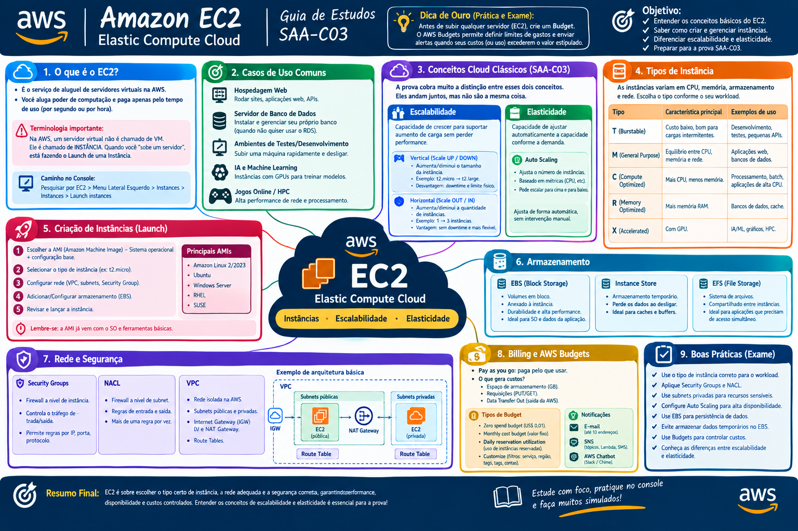

# 💻 Amazon EC2 - Aula 01: Billing e AWS Budgets

> 💡 **Dica de Ouro (Prática e Exame):** Antes de subir qualquer servidor (EC2), crie um Budget. O AWS Budgets permite definir limites personalizados de gastos e envia alertas automáticos quando seus custos (ou uso) excedem - ou estão previstos para exceder - o valor que você estipulou.

## 💰 1. Criação de Budget (Orçamento)
- 🧭 **Caminho no Console:** `Clique no nome da sua conta (canto superior direito) > Billing and Cost Management > Budgets > Create budget`

### Budget Setup e Templates (Configuração)
A AWS oferece duas formas principais de criar um orçamento:

1. **Use a template (Usar um modelo):**
   - É o jeito mais rápido, ideal para iniciantes e contas de estudo.
   - **Zero spend budget:** Alerta se os seus gastos passarem de US$ 0,01 (excelente para garantir que você está 100% dentro do *Free Tier*).
   - **Monthly cost budget:** Você define um valor fixo mensal (ex: US$ 20,00) e ele te avisa se ultrapassar.
   - **Daily reservation utilization:** Mais avançado, monitora se você está usando as instâncias reservadas que comprou.

2. **Customize (Personalizado):**
   - Forma avançada, muito cobrada no exame para cenários empresariais.
   - Permite filtrar custos de forma granular por: **Serviço** (ex: criar um orçamento só para o EC2), **Região**, **Tags de Alocação de Custos** (ex: orçamento para o projeto "Backend Java") ou contas vinculadas no *AWS Organizations*.
   - Permite criar *Cost budgets* (gastos em dinheiro) ou *Usage budgets* (volume de uso, ex: limite de horas de EC2 ou GB de tráfego).

---

## 🔔 2. Quando irei receber notificação de Budget?

Os alertas são disparados com base em **Limites de Alerta (Alert Thresholds)** que você mesmo configura. A grande sacada do AWS Budgets (e o que a AWS ama perguntar na prova) é que ele avalia dois cenários distintos:

- **Actual Costs (Custos Reais/Realizados):** Você é notificado quando o seu gasto **já atingiu** a porcentagem ou valor definido.
  - *Exemplo:* Alerta aos 80% do orçamento (Se o budget é $100, você recebe o e-mail no exato momento em que a fatura parcial bater $80).
  
- **Forecasted Costs (Custos Previstos):** Você é notificado de forma proativa. O algoritmo de Machine Learning da AWS projeta o seu gasto até o fim do mês baseado no seu ritmo atual de uso.
  - *Exemplo:* Alerta aos 100% dos custos previstos (Se no dia 10 a AWS calcular que você vai gastar $120 até o fim do mês em um budget de $100, você recebe o alerta **agora**, antes mesmo do gasto acontecer, dando tempo para desligar as instâncias EC2).

### Para onde as notificações são enviadas?
- **E-mail:** Até 10 endereços de e-mail por alerta.
- **Amazon SNS:** Dispara um tópico do SNS (que pode acionar Lambdas ou enviar SMS).
- **AWS Chatbot:** Integração direta para mandar o alerta no Slack ou Amazon Chime da equipe.

# 💻 Amazon EC2 - Aula 02: Conceitos Básicos e Instâncias

## ☁️ 1. O que é o EC2? (Elastic Compute Cloud)
- **Definição Básica:** É o serviço de aluguel de servidores virtuais na infraestrutura da AWS. Em vez de comprar hardware físico, você aluga poder de computação na nuvem e paga apenas pelo tempo que usar (cobrado por segundo ou por hora).
- 🚨 **Terminologia Chave:** Na AWS, um servidor virtual não é chamado de "VM" (Virtual Machine), ele é chamado de **INSTÂNCIA**. Quando você "sobe um servidor", você está fazendo o "Launch de uma Instância".
- 🧭 **Caminho no Console:** `Pesquisar por EC2 > Menu Lateral Esquerdo > Instances > Instances > Botão "Launch instances"`

### 🎯 Casos de Uso Comuns
- **Hospedagem Web (Web Server):** Rodar sites, aplicações web, APIs.
- **Servidor de Banco de Dados:** Instalar e gerenciar seu próprio banco de dados relacional ou NoSQL do zero (quando não quiser usar o Amazon RDS).
- **Ambientes de Testes/Desenvolvimento:** Subir uma máquina rapidamente para testar um código e desligá-la logo depois.
- **IA e Machine Learning:** Uso de instâncias superpoderosas com aceleração gráfica (GPUs) para treinar modelos complexos.
- **Jogos Online / HPC:** Servidores de multiplayer que exigem altíssima performance de rede e processamento (High Performance Computing).

---

## ⚖️ 2. Conceitos Cloud Clássicos (Foco Total SAA-C03)

A prova cobra muito a distinção entre esses dois conceitos. Eles andam juntos, mas não são a mesma coisa:

### 📈 Escalabilidade (Scalability)
É a capacidade do seu sistema de **crescer** para suportar um aumento de carga (mais usuários, mais processamento) sem perder performance. Divide-se em duas abordagens:
- **Vertical (Scale UP / Scale DOWN):** 
  - Aumentar ou diminuir o **tamanho/potência** da máquina.
  - *Exemplo:* Trocar uma instância `t2.micro` (1 vCPU, 1GB RAM) por uma `t2.large` (2 vCPU, 8GB RAM).
  - *Desvantagem:* Geralmente exige *downtime* (reiniciar a máquina) e possui um limite físico (existe um teto de quão grande um servidor pode ser).
- **Horizontal (Scale OUT / Scale IN):** 
  - Aumentar ou diminuir a **quantidade** de máquinas.
  - *Exemplo:* Passar de 2 instâncias rodando seu site para 10 instâncias.
  - *Vantagem para a Prova:* É o modelo **altamente recomendado** para arquiteturas modernas na nuvem (Alta Disponibilidade). Feito através do serviço *Auto Scaling Group (ASG)*.

### 🧽 Elasticidade (Elasticity)
É a capacidade do sistema de **ajustar os recursos automaticamente conforme a demanda**. 
- É a automação da escalabilidade horizontal.
- A verdadeira elasticidade garante que você faça o *Scale Out* (adicione instâncias) durante um pico de acesso (ex: Black Friday) e, o mais importante financeiramente, faça o *Scale In* (remova instâncias) quando o tráfego voltar ao normal, garantindo que você pare de pagar pelas máquinas desnecessárias.

# 💻 Amazon EC2 - Aula 03: Tipos de Instâncias e Precificação

> ⚠️ **Aviso de Ouro:** A nuvem é extremamente dinâmica. A AWS lança novas instâncias frequentemente. Para o ambiente de produção, **sempre verifique a documentação oficial da AWS** para os tipos mais recentes. Para a prova SAA-C03, concentre-se nos "casos de uso" de cada família.

## 🔠 1. Nomenclatura das Instâncias (Como ler)
- Lembre-se: **Instância = Máquina Virtual (VM)**.
- A AWS usa um padrão para nomear as instâncias. Exemplo: `m5a.large`
  - **`m`** = **Família** da instância (Uso Geral).
  - **`5`** = **Geração** (quanto maior o número, mais moderna e geralmente mais barata/eficiente).
  - **`a`** = **Sufixo / Atributos adicionais** (Ex: `a` para processador AMD, `g` para AWS Graviton/ARM, `n` para rede otimizada).
  - **`large`** = **Tamanho** da instância (define a quantidade de vCPUs e Memória RAM. Escala para `xlarge`, `2xlarge`, etc.).

---

## 🏗️ 2. Famílias de Instâncias (Tipos)
- 🧭 **Caminho no Console:** `EC2 > Instances > Launch instances > Aba "Instance type"`

### ⚖️ General Purpose (Uso Geral)
- **Letras comuns:** `t` (ex: t2, t3 - ideais para *burst/picos*), `m` (ex: m5, m6g).
- **O que é:** Proporção equilibrada entre CPU, Memória e Rede.
- **Caso de uso:** Aplicações comuns, servidores web padrão, repositórios de código, microsserviços. 

### ⚙️ Compute Optimized (Otimizada para Computação)
- **Letras comuns:** `c` (ex: c5, c6g).
- **O que é:** Alta proporção de processador (vCPU) em relação à memória.
- **Caso de uso:** Processamento em lote (Batch processing), transcodificação de mídia (vídeo/áudio), servidores web de altíssima performance, modelagem científica.

### 🧠 Memory Optimized (Otimizada para Memória) - *Extra para a Prova*
- **Letras comuns:** `r` (ex: r5, r6g), `x` (ex: x1, x2).
- **O que é:** Processam grandes volumes de dados diretamente na memória RAM, entregando respostas ultrarrápidas.
- **Caso de uso:** Bancos de dados relacionais pesados, bancos de dados em cache/memória (Redis, Memcached), análises de Big Data em tempo real.

### 🚀 Accelerated Computing (Computação Acelerada)
- **Letras comuns:** `p` (ex: p3, p4), `g` (ex: g4, g5).
- **O que é:** Instâncias equipadas com aceleradores de hardware como **GPUs** (Placas de vídeo poderosas) ou FPGAs.
- **Caso de uso:** **Inteligência Artificial (IA) e Machine Learning (Treinamento e Inferência)**, renderização 3D, cálculos gráficos pesados, direção autônoma.

### 🗄️ Storage Optimized (Otimizada para Armazenamento)
- **Letras comuns:** `i` (ex: i3, i4), `d` (ex: d2, d3).
- **O que é:** Acesso de leitura e gravação incrivelmente rápido e sequencial a conjuntos de dados imensos no disco local.
- **Caso de uso:** **Bancos de Dados NoSQL** (Cassandra, MongoDB), Data Warehousing (Redshift), sistemas de arquivos distribuídos, aplicações transacionais de alta frequência (muito IOPS).

### 🏎️ HPC Optimized (Otimizada para HPC)
- **Letras comuns:** `hpc` (ex: hpc6a).
- **O que é:** Desenvolvidas especificamente para rodar clusters de alto desempenho com latência de rede quase zero.
- **Caso de uso:** **HPC (High-Performance Computing)**. Simulações meteorológicas, aerodinâmicas (Fórmula 1), genômica e dinâmica de fluidos.

---

## 💸 3. Modelos de Preço (Pricing Models)
A prova vai te dar um cenário financeiro e pedir o melhor modelo de contratação.

- 🧭 **Caminho no Console:** `AWS Cost Management > Savings Plans` ou `EC2 > Spot Requests`

### ⏱️ Sob Demanda (On-Demand)
- **Como funciona:** Você paga por hora ou por segundo (dependendo do sistema operacional). Sem contrato e sem pagamento adiantado.
- **Quando usar:** Aplicações de curto prazo, novos projetos em que você ainda não sabe o padrão de uso, testes breves ou cargas de trabalho que não podem ser interrompidas. É o modelo **mais caro**.

### 📉 Savings Plans (Planos de Economia)
- **Como funciona:** Você se compromete com uma **quantidade de gasto constante** (ex: US$ 10,00 por hora) por um período de **1 ou 3 anos**. Em troca, recebe um desconto massivo (até 72%). 
- **Quando usar:** Cargas de trabalho consistentes, contínuas e de longo prazo (ex: o sistema de produção da sua empresa).
- > 💡 **Dica de Prova:** O *Compute Savings Plans* é extremamente flexível. O desconto se aplica mesmo se você mudar a família da instância (de `m5` para `c5`), a região, ou até se mudar de EC2 para AWS Fargate ou AWS Lambda.

### 🎯 Spot Instances (Instâncias Spot)
- **Como funciona:** Você "leiloa/solicita" a capacidade não utilizada dos servidores da AWS. Oferece o **maior desconto possível (até 90%)**.
- **O grande risco:** A AWS pode "tomar" a máquina de volta a qualquer momento se precisar da capacidade, te dando **apenas 2 minutos de aviso prévio** (Spot Instance Interruption Notice).
- **Quando usar (Certeza de Prova):** Cargas de trabalho tolerantes a falhas, flexíveis, e sem estado (Stateless). Exemplos: Processamento de imagens, jobs em lote que podem recomeçar de onde pararam, Big Data, CI/CD.
- **Quando NÃO usar:** Banco de dados de produção (onde se a máquina desligar do nada, você perde dados críticos).

# 💻 Amazon EC2 - Aula 04: Criação, Conexão e Ciclo de Vida

## 🚀 1. Passo a Passo: Criando uma Instância (Launch an Instance)
- 🧭 **Caminho no Console:** `EC2 > Instances > Launch instances`

O assistente de criação segue um fluxo lógico. Os principais passos são:
1. **Name and tags:** Dar um nome ao servidor (ex: `Web-Server-01`).
2. **AMI (Amazon Machine Image):** Escolher o Sistema Operacional (ex: Amazon Linux 2023, Ubuntu, Windows Server) e os softwares pré-instalados.
3. **Instance type:** Escolher a família e o tamanho da máquina (ex: `t2.micro` - elegível ao Free Tier).
4. **Key pair (login):** Criar ou selecionar um par de chaves de segurança (arquivo `.pem` ou `.ppk`). É o "crachá" criptográfico para acessar a máquina. **Se perder essa chave, você perde o acesso via SSH!**
5. **Network settings:** Definir a VPC (Rede), Subnet (Zona de Disponibilidade), se terá IP Público e configurar o **Security Group** (Firewall).
6. **Configure storage:** Definir o tamanho e o tipo do disco rígido virtual (EBS).

---

## 🛡️ 2. Security Group (SG)
É o **Firewall Virtual no nível da Instância**. Controla o tráfego que entra (Inbound) e sai (Outbound) do seu servidor.

- **Regra Padrão (Importante para a Prova):**
  - **Inbound (Entrada):** Por padrão, tudo é **BLOQUEADO**. Você precisa criar regras explícitas para permitir o tráfego (ex: abrir porta 22 para SSH ou porta 80 para HTTP).
  - **Outbound (Saída):** Por padrão, tudo é **PERMITIDO**. A instância pode acessar a internet livremente.
- > 🚨 **Dica de Prova (Stateful):** Security Groups são *Stateful* (guardam estado). Se você permitir que uma requisição **entre** na porta 80, a resposta dessa requisição tem permissão automática para **sair**, independentemente das regras de Outbound.

---

## 🔌 3. Como conectar na Instância?
Depois que a instância estiver com o *Instance State* como `Running` e tiver passado nos *Status Checks*, você pode acessá-la:

1. **SSH (Secure Shell):** Usando o terminal (Linux/Mac) ou PuTTY (Windows), apontando para o IP Público e usando a sua chave `.pem`. Exige a porta 22 aberta no Security Group.
2. **EC2 Instance Connect:** Conexão direta pelo próprio navegador no console da AWS. Muito prático, pois não exige gerenciamento manual da chave SSH na sua máquina, usando o próprio IAM para validar quem você é.
3. **Session Manager (SSM):** A forma **mais segura** (Adorada na SAA-C03!). Permite acessar a máquina sem precisar abrir nenhuma porta de entrada (como a 22) no Security Group.

---

## 💾 4. EBS (Elastic Block Store)
- É o "Disco Rígido / SSD" virtual conectado à sua instância EC2.
- É um armazenamento em **Blocos** (diferente do S3 que é Objetos).
- Ele é independente da instância. Ele vive na rede (conectado via cabo virtual de alta velocidade). Se a instância quebrar, seus dados no EBS continuam a salvo.

---

## 🛑 5. Instance State e Ciclo de Vida (Shutdown)

Como desligar ou destruir a máquina e o impacto financeiro:

- 🧭 **Caminho no Console:** `EC2 > Instances > Selecionar a máquina > Instance state`

### ⏸️ Stop (Parar a Instância)
- **O que acontece:** A máquina é "desligada" normalmente (como desligar o seu PC no botão iniciar). O IP Público é liberado e perdido (a menos que use um *Elastic IP*).
- > 🚨 **Eu ainda pago se parar a instância? SIM E NÃO.** 
  - Você **PARA** de pagar pelo uso do computador (EC2 Compute / cobrança por hora).
  - Você **CONTINUA PAGANDO** pelo armazenamento do disco! O **EBS** continua existindo guardando seus dados, e a AWS cobra pelos GBs alocados nele 24/7, mesmo com a EC2 desligada.

### 💀 Terminate (Encerrar / Destruir a Instância)
- **O que acontece:** A máquina é destruída permanentemente. Não pode ser recuperada.
- **E o disco (EBS)?** Por padrão, o volume raiz (Root Volume) é apagado junto com a instância (configuração *Delete on Termination* vem ativada). 
- **Cobrança:** Você para de ser cobrado por tudo (EC2 e EBS) assim que o processo de terminação é concluído.

# 🛡️ Amazon EC2 - Aula 05: Aprofundando em Security Groups (SGs)

## 🔄 1. Inbound e Outbound entre Instâncias (Regra de Ouro)
Na AWS, as instâncias frequentemente precisam se comunicar umas com as outras (ex: um Servidor Web precisando acessar um Servidor de Banco de Dados). 

> 🚨 **Dica Crítica de Prova (SAA-C03):** Para permitir essa comunicação, **NÃO use endereços IP** nas regras. IPs privados podem mudar se a máquina for recriada. A melhor prática absoluta de segurança na AWS é **referenciar o Security Group da outra instância** como a origem (Source).

**Como funciona na prática (Arquitetura de Camadas):**
- **Camada 1 (Web Server):** Possui o `SG-Web`, configurado com Inbound da internet (`0.0.0.0/0`) na porta 80/443.
- **Camada 2 (Database):** Possui o `SG-DB`. Em vez de liberar a porta 3306 (MySQL) para o IP do Web Server ou para a rede inteira, você cria uma regra Inbound na porta 3306 e coloca o ID do **`SG-Web`** como origem (*Source*).
- **O grande benefício:** Se o seu *Auto Scaling* criar mais 20 novos Servidores Web por causa de um pico de acesso, todos eles herdarão o `SG-Web` e ganharão acesso automático ao banco de dados na mesma hora, sem você precisar editar nenhuma regra de firewall.

---

## ✏️ 2. Editando Regras (Edit Rules)
- 🧭 **Caminho no Console:** `EC2 > Network & Security > Security Groups > Selecione o SG > Aba "Inbound rules" ou "Outbound rules" > Botão "Edit rules"`

### O que você precisa saber sobre a edição para a prova:
1. **Efeito Imediato:** Qualquer alteração feita em um Security Group (adicionar ou remover uma regra) entra em vigor **IMEDIATAMENTE** para todas as instâncias associadas a ele. Não é necessário reiniciar os servidores.
2. **APENAS Regras de PERMISSÃO (Allow-only):** 
   - Em um Security Group, você **só pode criar regras para PERMITIR** (Allow) o tráfego. 
   - Não existe opção "Bloquear / Deny". Tudo o que não está explicitamente na sua lista de regras é bloqueado por padrão (*Implicit Deny*).
   - > 🚨 **Pegadinha Clássica:** Se a questão pedir para "bloquear ativamente o endereço IP de um hacker", a resposta correta **NÃO** é usar o Security Group. A resposta será usar a **Network ACL (NACL)**, que atua na borda da sub-rede e suporta regras explícitas de bloqueio (Deny).
1. **Múltiplos SGs:** Uma única instância EC2 pode ter vários Security Groups anexados a ela ao mesmo tempo. As regras de todos eles se somam.

---

## 🗺️ Mapa Mental Resumo: Amazon EC2

