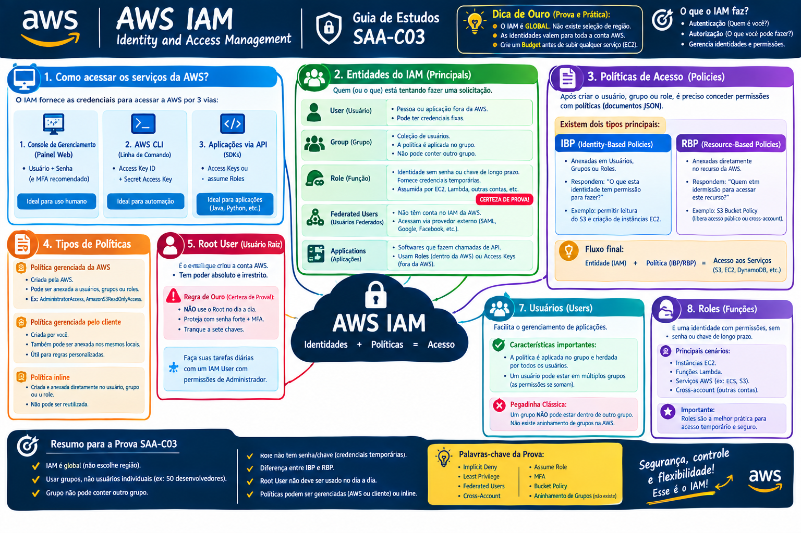

# 🔐 AWS IAM - Aula 01: Introdução ao Identity and Access Management

> 💡 **Dica de Ouro (Prática e Exame):** O IAM é um serviço **GLOBAL**. Você não seleciona uma Região (como us-east-1) ao criar usuários ou grupos. As identidades criadas no IAM valem para a conta AWS inteira. 

O IAM controla a **Autenticação** (Quem é você?) e a **Autorização** (O que você pode fazer?).

## 🚪 1. Como acessar os serviços da AWS?
O IAM fornece as credenciais necessárias para interagir com a nuvem através de três vias principais:

1. **AWS Management Console (Painel Web):** Acessado via navegador. Exige `Usuário + Senha` (e fortemente recomendado o uso de MFA - Autenticação em Múltiplos Fatores).
2. **AWS CLI (Linha de Comando):** Acessado via terminal. Exige `Access Key ID` e `Secret Access Key`.
3. **Aplicações via API (SDKs):** Códigos rodando na sua máquina ou em servidores (Java, Python, etc.) que interagem com a AWS. Também utilizam `Access Keys` ou assumem *Roles*.

---

## 👥 2. Entidades do IAM (Principals)
Quem (ou o que) está tentando fazer uma solicitação na AWS.

* **User (Usuário):** Representa uma pessoa específica (ex: Ranon) ou uma aplicação rodando fora da AWS que precisa de credenciais fixas.
* **Group (Grupo):** Uma coleção de usuários. É a melhor prática atribuir permissões ao grupo (ex: `Desenvolvedores`) e colocar os usuários dentro dele, em vez de dar permissões a cada usuário individualmente. *Nota de prova: Um grupo NÃO pode conter outro grupo.*
* **Role (Função):** **(Certeza de Prova!)** É uma identidade com permissões, mas que não tem senhas ou chaves de acesso de longo prazo. Ela fornece **credenciais temporárias**. É "assumida" por instâncias EC2, Lambdas, ou até usuários de outras contas AWS.
* **Federated Users (Usuários Federados):** Usuários que não têm conta criada no IAM da AWS, mas acessam a nuvem fazendo login através de um provedor externo (ex: Active Directory da empresa via SAML, Google, Facebook).
* **Applications (Aplicações):** Softwares que fazem chamadas de API para a AWS. Idealmente, usam *Roles* se rodarem dentro da AWS, ou *Access Keys* se rodarem fora.

---

## 📜 3. Políticas de Acesso (Policies)
Você criou o usuário ou a *Role*, mas por padrão eles não podem fazer absolutamente nada (*Implicit Deny*). É aqui que entram os documentos JSON chamados de **Políticas**, que concedem o acesso aos serviços.

Existem dois caminhos principais de autorização:

### 👤 IBP (Identity-Based Policies - Políticas baseadas em Identidade)
- **Onde é anexada:** Em Usuários, Grupos ou Roles.
- **O que faz:** Responde à pergunta *"O que esta identidade tem permissão para fazer?"*.
- *Exemplo:* Uma política anexada ao seu usuário dizendo que você pode ler arquivos no S3 e ligar instâncias EC2.

### 🗃️ RBP (Resource-Based Policies - Políticas baseadas em Recursos)
- **Onde é anexada:** Diretamente no recurso da AWS, e não no usuário.
- **O que faz:** Responde à pergunta *"Quem tem permissão para acessar este recurso?"*.
- *Exemplo:* Uma **S3 Bucket Policy**. Você anexa a política diretamente no balde do S3, dizendo que qualquer usuário anônimo da internet tem permissão para baixar imagens de lá.

**O Fluxo Final:** Entidade (IAM) + Política (IBP/RBP) = Acesso aos Serviços (S3, EC2, DynamoDB, etc).

# 🔐 AWS IAM - Aula 02: Entendendo Usuários, Grupos, Políticas e Roles

> 💡 **Foco SAA-C03:** A prova vai tentar te confundir sobre como aplicar permissões de forma eficiente. O cenário clássico descreve uma empresa com 50 novos desenvolvedores. A resposta correta **NUNCA** é anexar políticas a cada usuário individualmente. A resposta certa é: *Crie um Grupo (ex: "Desenvolvedores"), anexe a política ao Grupo e adicione os 50 usuários nele*.

## 👤 1. Usuários (Users)
Um IAM User é uma entidade que você cria na AWS para representar a pessoa ou aplicativo que interage com os serviços.

* **Root User (Usuário Raiz):** É o e-mail que criou a conta da AWS. Ele tem poder absoluto e irrestrito.
  - 🚨 **Regra de Ouro (Certeza de Prova!):** O usuário Root **NÃO** deve ser usado para tarefas do dia a dia. Ele deve ser protegido com uma senha fortíssima, MFA habilitado, e trancado a sete chaves. Suas tarefas diárias devem ser feitas por um IAM User com permissões de Administrador.
* **IAM User:** Usuário padrão criado dentro da conta. Por padrão, quando recém-criado, ele não tem permissão para fazer absolutamente nada (*Implicit Deny*).

---

## 👥 2. Grupos (Groups)
Um Grupo é apenas uma coleção lógica de Usuários IAM. Serve para facilitar a vida do administrador.

* **Características para a Prova:**
  - Você anexa a Política de Permissão (Policy) ao Grupo, e todos os usuários dentro dele herdam essa permissão automaticamente.
  - Um usuário pode participar de **múltiplos grupos** ao mesmo tempo (ex: Ranon pode estar no grupo `Dev` e no grupo `Admin`). As permissões se somam.
  - 🚨 **Pegadinha Clássica:** Um grupo **NÃO PODE** estar dentro de outro grupo. Na AWS não existe aninhamento de grupos (nested groups). Grupos contêm apenas usuários.

---

## 📜 3. Políticas (Policies)
São documentos de texto escritos em formato **JSON** (JavaScript Object Notation) que definem o que é permitido ou negado na AWS.

### 📝 Estrutura de uma Política (O que ler no JSON na hora da prova)
Você vai se deparar com trechos de código JSON na prova. Foque nestes 4 elementos (Lembre-se da sigla **EARC** ou **PARC** em inglês - *Principal, Action, Resource, Condition*):

1. **Effect (Efeito):** Só pode ser `Allow` (Permitir) ou `Deny` (Negar).
2. **Action (Ação):** Qual comando da API está sendo liberado/negado. *Ex: `s3:GetObject` (baixar arquivo), `ec2:StartInstances` (ligar servidor).*
3. **Resource (Recurso):** Em qual recurso específico essa ação pode ser feita. *Ex: `arn:aws:s3:::meu-bucket-secreto/*`.*
4. **Condition (Condição - Opcional):** Regras extras. *Ex: Permitir o acesso APENAS se o usuário estiver usando MFA (`aws:MultiFactorAuthPresent: true`) ou vier de um IP específico da empresa.*

### ⚖️ A Matemática das Permissões (Como a AWS decide se deixa você passar)
A AWS avalia as políticas do usuário seguindo uma lógica rígida:

1. **Implicit Deny (Negação Implícita):** Todo acesso começa como NEGADO. Se você não tem uma política dizendo "pode ir", você não vai.
2. **Explicit Allow (Permissão Explícita):** Se uma política diz `Effect: Allow`, a AWS deixa você passar.
3. **Explicit Deny (Negação Explícita):** O `Deny` **SEMPRE vence**. Se você tem uma política no seu Grupo de Dev dizendo `Allow` para ler o S3, mas tem uma política atrelada direto ao seu usuário dizendo `Deny` para o S3... o `Deny` atropela o `Allow` e você fica bloqueado.

---

## 🎭 4. Roles (Funções)
Uma *Role* (Função) é uma identidade no IAM, muito parecida com um Usuário, pois você também anexa a ela políticas de permissão (JSON) determinando o que ela pode ou não fazer. 

**A GRANDE DIFERENÇA:**
- Um **Usuário** tem credenciais fixas e de longo prazo (Senha de login ou Access Keys fixas).
- Uma **Role** NÃO tem senha e NÃO tem chaves fixas. Em vez disso, a entidade que "assume" a Role recebe **credenciais de segurança temporárias** fornecidas pelo *AWS STS (Security Token Service)*.

> 💡 **Dica de Ouro (Certeza Absoluta de Prova):** Se a questão disser que uma aplicação rodando em uma instância EC2 precisa acessar arquivos no S3 ou ler um banco de dados DynamoDB, a resposta **NUNCA** será "Salvar as credenciais no código da máquina". A resposta correta será SEMPRE: **"Anexar uma IAM Role à instância EC2"**.

### 🎯 Principais Casos de Uso (O que cai no exame)
1. **Service Roles (Serviços da AWS):** Você permite que um serviço da AWS aja em seu nome (Ex: Uma máquina EC2 assumindo uma Role para gravar logs no CloudWatch ou baixar arquivos do S3).
2. **Cross-Account Access (Acesso entre contas):** Permite que usuários de uma conta da AWS (ex: Conta de Desenvolvimento) acessem os recursos de outra conta da AWS (ex: Conta de Produção) assumindo uma Role temporária na conta de destino.
3. **Identity Federation (Federação de Identidades):** Permite que funcionários usando logins do Active Directory corporativo, ou usuários finais logando via Google/Facebook (via Amazon Cognito), recebam credenciais temporárias para interagir com a sua nuvem, sem precisarem de contas criadas no IAM.

# 🔐 AWS IAM - Aula 03: Criando um Usuário (Passo a Passo)

> 💡 **Foco SAA-C03:** A AWS separou recentemente a criação do usuário da criação de suas chaves de acesso (Access Keys). Na prova, lembre-se: criar um usuário IAM não gera automaticamente chaves de acesso para a CLI. Isso deve ser feito como um passo adicional se o usuário for realizar acesso programático.

## 🛠️ 1. O Caminho para Criar um Usuário (Add User)
- 🧭 **Caminho no Console:** `Pesquisar por IAM > Menu lateral esquerdo: Access management > Users > Botão "Create user" (ou "Add users")`

### Passo a Passo no Console:

**Passo 1: Detalhes do Usuário (User details)**
- **User name:** Defina o nome do usuário (ex: `ranon.admin`).
- **Acesso ao Console de Gerenciamento (AWS Management Console):** 
  - Se você marcar esta opção, o usuário poderá fazer login no painel web (interface gráfica).
  - A AWS permite que você gere uma senha automática ou crie uma senha personalizada.
  - *Boa prática:* Marque a caixa que exige que o usuário altere a senha no primeiro login.

**Passo 2: Configurar Permissões (Set permissions)**
A AWS oferece 3 opções para conceder permissões ao novo usuário. Lembre-se sempre do *Princípio do Menor Privilégio*:
1. **Adicionar o usuário a um grupo (Add user to group):** É a **Prática Recomendada** (Best Practice) e a resposta certa na maioria das questões da SAA-C03. Você seleciona um grupo existente (ex: `DatabaseAdmins`) e o usuário herda todas as políticas dele.
2. **Copiar permissões (Copy permissions):** Copia exatamente as mesmas permissões e grupos de um usuário que já existe na sua conta.
3. **Anexar políticas diretamente (Attach policies directly):** Você escolhe manualmente as políticas (JSON) da lista (ex: `AmazonS3FullAccess`) e atrela direto ao usuário. *Evite usar isso no dia a dia, pois dificulta a auditoria no longo prazo.*

**Passo 3: Revisão e Tags**
- **Tags (Opcional):** Você pode adicionar etiquetas de chave-valor (ex: `Departamento: Engenharia` ou `Projeto: Backend Java`). Isso é muito útil para organizar o faturamento e saber o custo que cada time está gerando.
- **Create User:** Confirme a criação. 

---

## 🔑 2. Acesso Programático e MFA (O que fazer após criar)
Logo após a tela de sucesso da criação do usuário, você terá os próximos passos de segurança críticos.

- 🧭 **Caminho no Console:** `IAM > Users > Selecione o usuário criado > Aba "Security credentials"`

### A. Access Keys (Chaves de Acesso para CLI/API)
- Se o seu usuário precisar usar o terminal (AWS CLI) ou rodar scripts em Python/Java usando o SDK, ele vai precisar de *Access Keys*.
- Você deve clicar no botão **"Create access key"**.
- A AWS vai gerar um `Access Key ID` e uma `Secret Access Key`.
- 🚨 **Regra de Ouro (Certeza de Prova!):** A `Secret Access Key` só é exibida **UMA ÚNICA VEZ** nesta tela. Se você fechar a janela ou perder o arquivo `.csv`, a AWS não tem como te mostrar a senha novamente. Você terá que deletar a chave e criar uma nova.

### B. MFA (Multi-Factor Authentication)
- Ativar o MFA exige que o usuário insira um código de 6 dígitos gerado no celular (ex: Google Authenticator, Authy) ou use uma chave física USB (YubiKey) para conseguir logar.
- **Aplica-se ao Root User e ao IAM User.** A AWS considera o MFA a linha de defesa mais básica e essencial para proteger sua conta contra senhas vazadas.

# 🔐 AWS IAM - Aula 04: Aplicando Políticas (As Alternativas)

> 💡 **Foco SAA-C03:** O exame testa fortemente a sua capacidade de gerenciar permissões em escala (ex: uma empresa com centenas de funcionários). A regra de ouro da AWS é: **Evite ao máximo anexar políticas diretamente a usuários individuais.** 

Embora na aula a política tenha sido aplicada diretamente ao usuário para fins de demonstração, na vida real e na prova, você tem três caminhos para conceder permissões. Entenda as diferenças:

## ❌ 1. Anexar Diretamente ao Usuário (Attach policies directly)
- **Como funciona:** Você seleciona o usuário `Ranon` e atrela a política `AmazonS3FullAccess` diretamente a ele.
- **Por que evitar:** Imagine que a sua empresa contrate mais 50 desenvolvedores. Você teria que entrar no perfil de cada um dos 50 usuários e anexar a política manualmente um por um. Se amanhã eles precisarem de acesso ao EC2, você terá que repetir o processo manual 50 vezes. 
- **Quando usar:** Apenas para exceções raríssimas. Por exemplo, um usuário específico precisa de uma permissão ultra-restrita e temporária que ninguém mais no time precisa.

---

## ✅ 2. A Alternativa Padrão: Através de Grupos (Add user to group)
- **Como funciona:** Você cria um Grupo chamado `Desenvolvedores` e anexa a política `AmazonS3FullAccess` a este grupo. Depois, você simplesmente coloca o `Ranon` e os outros 50 novos funcionários dentro deste grupo.
- **O Benefício (Melhor Prática AWS):** **Escalabilidade (RBAC - Role-Based Access Control).** Todos os usuários herdam instantaneamente as permissões do grupo. Se amanhã o time inteiro precisar de acesso ao EC2, basta anexar a política no Grupo UMA vez, e os 51 desenvolvedores ganharão o acesso automaticamente na mesma hora.
- **O que cai na prova:** Sempre que a questão envolver "facilitar a administração de permissões para times que crescem", a resposta será gerenciar via Grupos.

---

## 🎭 3. A Alternativa para Máquinas e Sistemas: Através de Roles (Assume Role)
- **Como funciona:** Em vez de dar a permissão para um *Usuário* (Pessoa), você anexa a política a uma *Role* (Função). 
- **O Benefício:** Não envolve senhas fixas. Outras entidades (como uma máquina EC2, uma função Lambda, ou até um usuário logando via Google/Active Directory) podem "assumir" essa Role e ganhar a permissão atrelada a ela de forma temporária.
- **O que cai na prova:** Políticas anexadas a Roles são a solução padrão de segurança para comunicação "Serviço-para-Serviço" dentro da AWS.

---

## 📝 Bônus Teórico: Tipos de Políticas
Quando você escolhe anexar uma política (seja no Grupo ou no Usuário), você se depara com dois tipos:

1. **AWS Managed Policies (Gerenciadas pela AWS):**
   - Políticas criadas e mantidas pela própria AWS (ex: `AdministratorAccess`, `AmazonEC2ReadOnlyAccess`). 
   - Vantagem: Prontas para uso e atualizadas automaticamente pela AWS quando novos recursos são lançados.

2. **Customer Managed Policies (Gerenciadas pelo Cliente):**
   - Políticas JSON customizadas que você mesmo escreve para atender a um requisito muito específico da sua empresa (Princípio do Menor Privilégio extremo).
   - *Nota:* Também existem as **Inline Policies** (Políticas em linha), que são políticas JSON coladas diretamente dentro de um único usuário/grupo e que não podem ser reaproveitadas por outros. A AWS recomenda evitar *Inline Policies* e usar *Managed Policies*. 

# 🔐 AWS IAM - Aula 04: MFA (Multi-Factor Authentication)

> 💡 **Foco SAA-C03:** A AWS considera o MFA a prática de segurança número um para proteger contas contra vazamento de senhas. Se uma questão perguntar qual a maneira mais eficaz e imediata de proteger o **Root User** (Usuário Raiz), a resposta será sempre: **Ativar o MFA**.

## 🛡️ 1. O que é o MFA?
O MFA adiciona uma camada extra de proteção ao processo de login. Para acessar a conta AWS (seja pelo console web ou via CLI/API), o usuário precisa fornecer duas coisas:
1. **Algo que ele SABE:** O nome de usuário e a senha.
2. **Algo que ele TEM:** Um código numérico temporário gerado por um dispositivo físico ou aplicativo.

Mesmo que um hacker descubra a sua senha, ele não conseguirá entrar na conta sem ter acesso físico ao seu dispositivo MFA.

---

## 📱 2. Tipos de Dispositivos MFA Suportados
A AWS permite configurar o MFA usando diferentes tecnologias:

1. **Virtual MFA Device (Dispositivos Virtuais - Mais Comum):**
   - Aplicativos instalados no celular (ex: Google Authenticator, Authy, Microsoft Authenticator).
   - *Vantagem:* Gratuito e fácil de configurar via QR Code. Um único celular pode gerar códigos para múltiplas contas da AWS.
2. **Hardware Key (Chave de Segurança Física - U2F/FIDO2):**
   - Um dispositivo USB (ex: YubiKey) que você conecta no computador e toca com o dedo para liberar o acesso.
   - *Vantagem:* É o método mais seguro disponível, pois é imune a ataques de *phishing* (onde o hacker tenta roubar o código numérico).
3. **Hardware Token (Token de Hardware Padrão):**
   - Um chaveirinho físico que gera os números em uma pequena tela (estilo token de banco antigo, como os da Gemalto).
   - *Vantagem:* Útil para ambientes corporativos ultrarrecritos onde o uso de celulares não é permitido dentro do prédio.

---

## ⚙️ 3. Como e Onde Configurar?
- 🧭 **Caminho no Console:** `IAM > Users > Selecione o Usuário > Aba "Security credentials" > Na seção Multi-factor authentication (MFA), clique em "Assign MFA device"`

### Detalhes Importantes para a Prova:
- O MFA deve ser ativado **individualmente** por usuário. Você não ativa o MFA em um "Grupo" (você não pode obrigar todos os membros do grupo a usarem o mesmo celular).
- **Múltiplos MFAs:** A AWS agora permite registrar *vários* dispositivos MFA para um único usuário (ex: você pode cadastrar o seu Authy no celular e uma YubiKey de backup).
- **MFA em Políticas (JSON):** Você pode criar uma política (Condition) que proíbe um usuário de desligar instâncias EC2 ou deletar arquivos no S3 a menos que ele tenha logado usando o MFA naquele momento. A condição no JSON fica assim: `"aws:MultiFactorAuthPresent": "true"`.

# 🔐 AWS IAM - Aula 05: STS (Security Token Service) e a Anatomia das Roles

> 💡 **Foco SAA-C03:** O exame testa se você entende a diferença entre credenciais de longo prazo (IAM Users) e credenciais de curto prazo (STS). Sempre que a questão mencionar "Temporary credentials" (Credenciais temporárias), a resposta inevitavelmente envolverá o **AWS STS** e **IAM Roles**.

## 🎟️ 1. O que é o AWS STS (Security Token Service)?
O STS é o serviço da AWS responsável por criar e fornecer **credenciais de segurança temporárias**. 
- **Tempo de vida (TTL):** As credenciais geradas pelo STS duram de 15 minutos a 12 horas. Após esse período, elas expiram e se autodestroem.
- **Vantagem:** Se um hacker roubar um token do STS, ele terá uma janela de tempo curtíssima para usá-lo, diferentemente de uma *Access Key* de um usuário comum, que funciona para sempre até ser deletada manualmente.

---

## 🎭 2. A Anatomia de uma IAM Role (As Duas Políticas)
Quando você cria uma Role no console para ser usada via STS, você precisa configurar **duas políticas (Policies)** diferentes. Essa distinção é crucial para a prova:

### 🤝 A. Trust Policy (Política de Confiança)
- **O que faz:** Define **QUEM** ou **O QUE** tem permissão para "vestir" (assumir) essa Role. 
- **Exemplo de uso:** Você escreve no JSON da Trust Policy que *apenas o serviço Amazon EC2* ou *apenas o usuário Ranon da Conta B* tem autorização para chamar o STS e pedir as credenciais temporárias dessa Role. Se o serviço Lambda tentar assumir essa Role, o STS vai negar.

### 📜 B. Permissions Policy (Política de Permissões)
- **O que faz:** Define **O QUE** a entidade pode fazer na AWS *depois* que ela vestir a Role.
- **Exemplo de uso:** É a política tradicional (ex: `AmazonS3FullAccess`). Ela diz que, uma vez que o EC2 assumiu a Role com sucesso, ele tem permissão para ler e gravar no bucket do S3.

---

## 🔄 3. O Fluxo Prático (Como tudo se conecta)
Imagine que uma aplicação na sua instância EC2 precisa baixar uma foto do S3. O passo a passo invisível que acontece é:

1. O administrador anexa a **IAM Role** na instância EC2.
2. A aplicação dentro do EC2 tenta acessar o S3.
3. O EC2, por baixo dos panos, chama o **AWS STS** pedindo acesso.
4. O STS verifica a **Trust Policy** ("O EC2 tem permissão para assumir essa Role? Sim").
5. O STS gera chaves de acesso temporárias e as devolve para o EC2.
6. O EC2 usa essas chaves temporárias para acessar o S3.
7. A AWS verifica a **Permissions Policy** ("Essas chaves dão acesso ao S3? Sim") e libera o download da foto.

Tudo isso acontece em milissegundos, sem que você precise escrever nenhuma senha no código da sua aplicação.

# 🔐 AWS IAM - Aula 06: Políticas de Identidade vs Recursos, Inline e Managed Policies

> 💡 **Foco SAA-C03:** A prova exige que você saiba escolher o tipo certo de política para cada cenário. A melhor regra mental para o exame é: **Políticas de Identidade aplicam-se a Usuários, Grupos e Roles. Políticas de Recurso aplicam-se diretamente a Recursos da AWS (ex: Buckets S3).**

## 🔀 1. Política de Identidade vs. Política de Recurso

A AWS permite que você conceda permissões de duas formas complementares. É essencial entender a diferença e a aplicação exata de cada uma:

### 👤 Políticas Baseadas em Identidade (Identity-Based Policies)
- **Onde é anexada:** Exclusivamente em **IAM Users**, **Groups** ou **Roles**.
- **O que faz:** Controla o que aquela identidade específica PODE FAZER.
- **Exemplo:** Você atrela uma política ao grupo *Desenvolvedores* permitindo que eles deletem instâncias EC2.
- **Detalhe do JSON:** Não precisa do campo `Principal` no JSON, pois a política já está grudada na identidade que vai executá-la.

### 🗃️ Políticas Baseadas em Recurso (Resource-Based Policies)
- **Onde é anexada:** Diretamente no **recurso da AWS** (ex: um Bucket do S3, uma Chave do KMS, uma Fila do SQS).
- **O que faz:** Controla QUEM PODE ACESSAR aquele recurso.
- **Exemplo:** Uma *S3 Bucket Policy* anexada direto no bucket, liberando o acesso público de leitura para qualquer pessoa na internet.
- **Detalhe do JSON:** **Obrigatoriamente** precisa ter o campo `Principal` no JSON, para definir exatamente quem (qual usuário, conta ou role) está recebendo aquela permissão de acesso ao recurso.

---

## 🧩 2. Tipos de Políticas (Managed vs. Inline)

Quando você trabalha com Políticas Baseadas em Identidade, você tem três "sabores" para escolher:

### 🅰️ AWS Managed Policies (Gerenciadas pela AWS)
- Políticas prontas, criadas e mantidas pela própria AWS (ex: `AdministratorAccess`, `AmazonS3ReadOnlyAccess`).
- **Vantagem:** Você não precisa escrever o JSON. Elas são atualizadas automaticamente pela AWS quando novos serviços são lançados.
- **Desvantagem:** Podem ser muito amplas, violando o Princípio do Menor Privilégio.

### 🛠️ Customer Managed Policies (Gerenciadas pelo Cliente)
- Políticas standalone (independentes) que **você** cria escrevendo o próprio JSON.
- **Vantagem:** São reutilizáveis. Você cria a política uma vez (ex: "Permitir acesso apenas à pasta de RH no S3") e pode anexá-la a múltiplos **Grupos, Roles ou Usuários**.
- **Melhor Prática:** É a forma mais recomendada pela AWS para criar permissões granulares em ambientes empresariais.

### 🔒 Inline Policies (Políticas Embutidas / 1 para 1)
- **O que é:** É uma política criada e "chumbada" diretamente dentro de um **único** Usuário, Grupo ou Role.
- **Relação 1 para 1:** Ela não existe como um objeto independente no IAM. Se você deletar o usuário, a política é deletada junto. Ela não pode ser reaproveitada por outra pessoa.
- **Quando usar (Cenário de Prova):** Use *apenas* quando houver uma restrição de segurança severa onde você quer ter a garantia absoluta de que aquela política nunca será anexada acidentalmente a outro usuário ou grupo.

---

## 🛠️ 3. Caminho de Criação (Console AWS)

Para criar uma política autônoma (Customer Managed Policy) e deixá-la pronta para ser usada por Grupos ou Roles:

- 🧭 **Caminho no Console:** `IAM > Menu lateral: Policies > Botão "Create policy"`

### O processo de criação:
1. **Editor Visual vs JSON:** A AWS oferece um *Visual Editor* onde você escolhe os serviços e ações clicando em botões, e ele monta o código para você. Alternativamente, você pode usar a aba *JSON* para colar um código pronto.
2. **Definir Permissões:** Escolha o Serviço (ex: S3), a Ação (ex: ListBucket) e o Recurso (ex: ARN do bucket específico).
3. **Revisão:** Dê um nome para a sua política (ex: `Policy-AcessoRH`) e uma descrição clara.
4. **Finalizar:** Clique em `Create policy`. Agora ela aparecerá na lista junto com as da AWS, pronta para ser anexada a qualquer identidade!

# 🔐 AWS IAM - Aula 07: Estrutura de Políticas (Anatomia do JSON)

> 💡 **Foco SAA-C03:** Você não precisará escrever um JSON do zero na prova, mas frequentemente as questões vão te mostrar uma política e perguntar: *"Por que o usuário Ranon não consegue acessar o bucket S3?"*. O segredo é escanear rapidamente o JSON buscando o bloco `Effect: Deny` ou alguma `Condition` que não está sendo atendida.

## 📝 1. Template Básico do JSON (A Estrutura)
Toda política no IAM segue uma estrutura lógica de chaves e valores. Aqui está o esqueleto de como uma política é desenhada:

~~~json
{
  "Version": "2012-10-17",
  "Statement": [
    {
      "Sid": "IdentificadorOpcionalDaRegra",
      "Effect": "Allow_ou_Deny",
      "Principal": { "AWS": ["arn:aws:iam::conta:user/usuario"] }, 
      "Action": ["servico:AcaoDesejada"],
      "Resource": ["arn:aws:servico:regiao:conta:recurso"],
      "Condition": {
        "OperadorDeCondicao": {
          "ChaveAWS": "ValorEsperado"
        }
      }
    }
  ]
}
~~~

---

## 🔍 2. Explicando os Elementos (O acrônimo PARC)
Para dominar a leitura de políticas, lembre-se dos 4 pilares: **P**rincipal, **A**ction, **R**esource, **C**ondition.

* **`Version`**: A versão da linguagem da política. Sempre será `"2012-10-17"` (é a versão mais recente, mesmo sendo antiga). Se cair `"2008-10-17"`, recursos modernos podem não funcionar.
* **`Statement`**: É o array (lista) que contém as regras. Uma política pode ter múltiplos Statements (ex: um para liberar S3, outro para bloquear EC2).
* **`Sid` (Statement ID):** Opcional. É apenas um nome ou descrição que você dá para aquele bloco para facilitar a leitura humana.
* **`Effect`**: O resultado da regra. Só aceita dois valores: `"Allow"` (Permitir) ou `"Deny"` (Negar). Lembre-se: **Deny explícito sempre vence**.
* **`Principal`**: **(Atenção!)** Indica *QUEM* recebe a permissão.
  - Se for uma *Identity-based Policy* (anexada a um usuário), esse campo **NÃO** existe (pois a política já está no usuário).
  - Se for uma *Resource-based Policy* (anexada direto num Bucket S3), esse campo é **obrigatório** para dizer quem pode acessar o bucket.
* **`Action`**: Qual comando (API) está sendo liberado ou bloqueado. Segue o formato `servico:acao`. (Ex: `s3:PutObject`, `ec2:StartInstances`, ou `s3:*` para liberar tudo do S3).
* **`Resource`**: Qual é o alvo da ação. Na AWS, tudo tem um "RG" chamado **ARN** (Amazon Resource Name). Você coloca o ARN exato do bucket ou da máquina aqui.
* **`Condition`**: Opcional. Regras extras para que o *Effect* seja válido. (Ex: Só permitir se o IP de origem for o IP do escritório da empresa, ou se tiver MFA ativo).

---

## 🛠️ 3. Exemplo Prático de Uso (Cenário de Exame)

**Cenário:** O administrador quer garantir que o Grupo de Desenvolvedores possa gerenciar um bucket S3 específico chamado `meu-bucket-projetos`, **MAS** eles só podem fazer isso se estiverem logados usando o **MFA (Autenticação Multifator)**.

Como essa política é anexada ao Grupo (Identity-based), ela não possui o campo `Principal`.

~~~json
{
  "Version": "2012-10-17",
  "Statement": [
    {
      "Sid": "PermitirAcessoTotalAoS3",
      "Effect": "Allow",
      "Action": [
        "s3:*"
      ],
      "Resource": [
        "arn:aws:s3:::meu-bucket-projetos",
        "arn:aws:s3:::meu-bucket-projetos/*"
      ],
      "Condition": {
        "Bool": {
          "aws:MultiFactorAuthPresent": "true"
        }
      }
    }
  ]
}
~~~

### 🧠 Como ler esse JSON na hora da prova:
1. **O que ele faz?** `Effect: Allow` e `Action: s3:*` (Permite fazer qualquer coisa no S3).
2. **Onde?** `Resource` aponta para o `meu-bucket-projetos` e todo o conteúdo dentro dele (`/*`).
3. **Qual a pegadinha?** A `Condition` exige que o valor booleano (`Bool`) da presença do MFA (`aws:MultiFactorAuthPresent`) seja verdadeiro (`"true"`). Se o desenvolvedor logar apenas com usuário e senha e tentar acessar o S3, a AWS vai bloquear com *Access Denied*.

# 🔐 AWS IAM - Aula 08: Boas Práticas (IAM Best Practices)

> 💡 **Foco SAA-C03:** O exame testa essas regras o tempo todo em cenários de *troubleshooting* e arquitetura. Se uma questão sugere que a empresa compartilha credenciais ou usa o usuário Root para gerenciar servidores, a alternativa correta **sempre** será corrigir essa falha seguindo as práticas abaixo.

## 🏆 As 7 Regras de Ouro do IAM

### 1. 🚫 Não utilize a conta Root
- O usuário raiz (e-mail de criação da conta) tem acesso irrestrito a todos os recursos e dados. 
- **Prática:** Tranque a conta Root com uma senha complexa e MFA. Use-a apenas para tarefas exclusivas (como alterar o plano de suporte ou fechar a conta AWS). Para o dia a dia, crie um IAM User com permissões de Administrador.

### 2. 👤 Crie contas IAM Individuais
- **Prática:** Nunca compartilhe usuários (ex: um usuário chamado "equipe-dev"). Cada pessoa física deve ter seu próprio IAM User.
- **Por quê?** Isso garante a **Auditoria**. O serviço AWS CloudTrail registra quem fez o quê. Se todos usam o mesmo login, é impossível saber quem deletou o banco de dados.

### 3. 👥 Gerencie permissões via Grupos (RBAC)
- **Prática:** Crie Grupos (ex: `Admins`, `DBAs`, `Estagiarios`), anexe as políticas (Policies) aos grupos e adicione os usuários dentro deles.
- **Por quê?** Facilita a manutenção em larga escala. Quando um funcionário muda de setor, basta trocá-lo de grupo e as permissões são ajustadas automaticamente.

### 4. ⚖️ Permita o Mínimo Possível (Princípio do Menor Privilégio)
- **Prática:** Nunca dê acesso `s3:*` (acesso total) se o usuário só precisa ler (`s3:GetObject`) um único bucket. 
- **O que cai na prova:** Comece com *Implicit Deny* (Zero permissões) e vá liberando aos poucos apenas o que for estritamente necessário para a pessoa ou máquina executar a tarefa.

### 5. 📜 Ordem de preferência de Políticas (Policies)
Na hora de escolher qual política anexar, siga a hierarquia de melhores práticas:
1. **AWS Managed Policies:** (1ª Opção). Use as que já vêm prontas da AWS (ex: `AmazonRDSFullAccess`). É mais seguro e você não tem trabalho de manutenção.
2. **Customer Managed Policies:** (2ª Opção). Crie seu próprio JSON reutilizável se as políticas da AWS forem muito amplas para o seu caso de uso (para garantir o Menor Privilégio).
3. **Inline Policies:** (Evite ao máximo). Use apenas para exceções onde a política não pode, sob hipótese alguma, ser reaproveitada por outra identidade.

### 6. 📱 Habilite o MFA (Multi-Factor Authentication)
- **Prática:** Obrigue o uso de MFA para todos os usuários IAM, especialmente aqueles com permissões administrativas e para a conta Root. Isso protege a conta mesmo que a senha seja vazada.

### 7. 🔑 Faça uma Revisão da Política de Senhas (Password Policy)
- **Prática:** Configure as regras da conta para exigir senhas fortes.
- **Configurações recomendadas:** Tamanho mínimo (ex: 14 caracteres), exigir letras maiúsculas, minúsculas, números e símbolos. Configurar a expiração (troca obrigatória a cada 90 dias) e impedir a reutilização das últimas senhas.

---

## 🗺️ Mapa Mental Resumo: IAM

