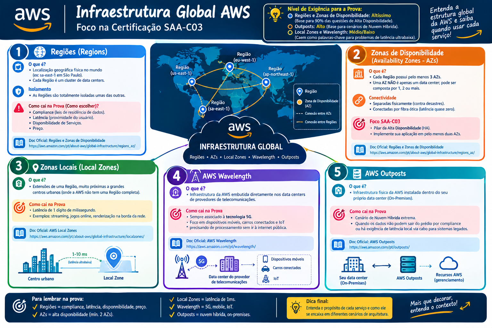

# 🌍 Infraestrutura Global AWS - Foco na Certificação SAA-C03

> 💡 **Nível de Exigência para a Prova:** 
> - **Regiões e Zonas de Disponibilidade:** Altíssimo (Base para 90% das questões de Alta Disponibilidade).
> - **Outposts:** Alto (Base para cenários de Nuvem Híbrida).
> - **Local Zones e Wavelength:** Médio/Baixo (Caem como palavras-chave para problemas de "latência ultrabaixa").

## 🗺️ 1. Regiões (Regions)
- **O que é:** Uma localização geográfica física no mundo (ex: `sa-east-1` em São Paulo). Cada Região é um cluster de data centers.
- **Isolamento:** As Regiões são **totalmente isoladas** umas das outras.
- 🚨 **Como cai na Prova (Como escolher):** Compliance (leis de residência de dados), Latência (proximidade do usuário), Disponibilidade de Serviços e Preço.
- 📚 **Doc Oficial:** [Regiões e Zonas de Disponibilidade](https://aws.amazon.com/pt/about-aws/global-infrastructure/regions_az/)

## 🏢 2. Zonas de Disponibilidade (Availability Zones - AZs)
- **O que é:** Cada Região possui **pelo menos 3 AZs**. Uma AZ **NÃO** é apenas um data center; pode ser composta por 1, 2 ou mais.
- **Conectividade:** Separadas fisicamente (contra desastres) mas conectadas por fibra ótica (latência quase zero).
- 🚨 **Foco SAA-C03:** Pilar da **Alta Disponibilidade (HA)**. Implante sua aplicação em pelo menos duas AZs.
- 📚 **Doc Oficial:** [Regiões e Zonas de Disponibilidade](https://aws.amazon.com/pt/about-aws/global-infrastructure/regions_az/)

## 📍 3. Zonas Locais (Local Zones)
- **O que é:** Extensões de uma Região colocadas muito próximas a grandes centros urbanos (onde a AWS não tem uma Região completa).
- **Como cai na Prova:** A palavra-chave é **Latência de 1 dígito de milissegundo** (ex: streaming, jogos online, renderização na borda da rede).
- 📚 **Doc Oficial:** [AWS Local Zones](https://aws.amazon.com/pt/about-aws/global-infrastructure/localzones/)

## 📡 4. AWS Wavelength
- **O que é:** Infraestrutura da AWS embutida diretamente nos data centers de **provedores de telecomunicações**.
- **Como cai na Prova:** Associado **SEMPRE à tecnologia 5G**. Foco em dispositivos móveis, carros conectados e IoT precisando de processamento sem ir à internet pública.
- 📚 **Doc Oficial:** [AWS Wavelength](https://aws.amazon.com/pt/wavelength/)

## 🏗️ 5. AWS Outposts
- **O que é:** Infraestrutura física da AWS instalada **dentro do seu próprio data center** (On-Premises). 
- **Como cai na Prova:** Cenário de **Nuvem Híbrida extrema**. Quando os dados não podem sair do prédio por compliance ou há exigência de latência local via cabo para sistemas legados.
- 📚 **Doc Oficial:** [AWS Outposts](https://aws.amazon.com/pt/outposts/)

---

## 🗺️ Mapa Mental Resumo: Infraestrutura Global AWS

