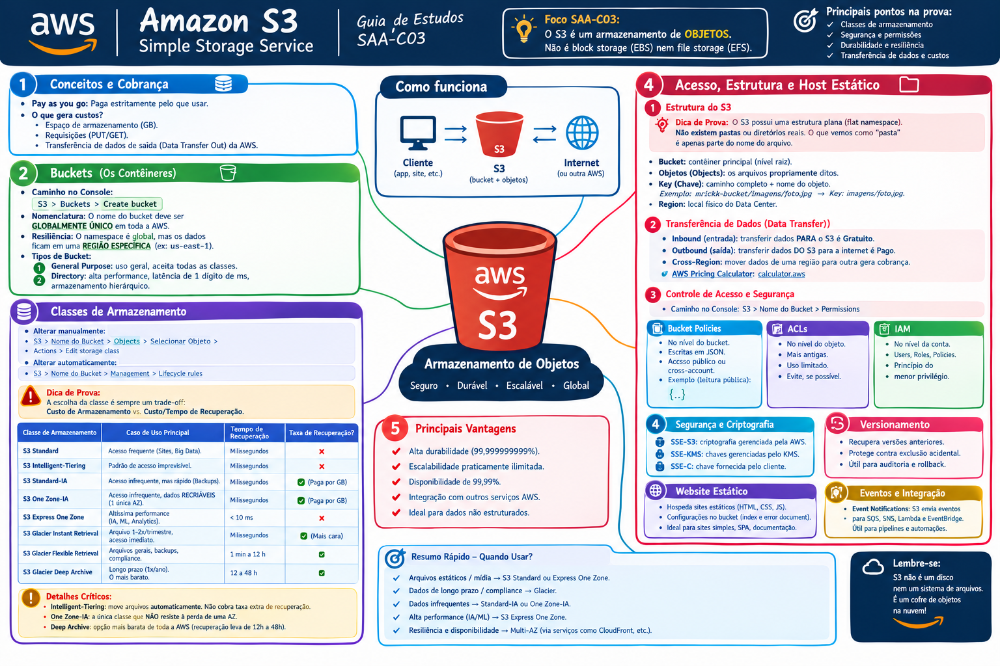

# 🪣 Amazon S3 (Simple Storage Service) - Guia SAA-C03

> 💡 **Foco SAA-C03:** O S3 é um armazenamento de **OBJETOS**. Não é block storage (EBS) nem file storage (EFS). 

---

## 📚 AULA 01: Conceitos e Classes de Armazenamento

### 🧠 1. Conceitos e Cobrança
- **Pay as you go:** Paga estritamente pelo que usar.
- **O que gera custos?** 
  - Espaço de armazenamento (GB).
  - Requisições (PUT/GET).
  - Transferência de dados de saída (*Data Transfer Out* da AWS).

### 📦 2. Buckets (Os Contêineres)
- 🧭 **Caminho no Console:** `S3 > Buckets > Create bucket`
- **Nomenclatura:** O nome do bucket deve ser **GLOBALMENTE ÚNICO** em toda a AWS.
- **Resiliência:** O namespace é global, mas os dados ficam em uma **REGIÃO ESPECÍFICA** (ex: `us-east-1`).
- **Tipos de Bucket:**
  1. **General Purpose:** Uso geral, aceita todas as classes de armazenamento.
  2. **Directory:** Alta performance, latência de 1 dígito de milissegundo, armazenamento hierárquico.

### 📊 3. Classes de Armazenamento (Storage Classes)
- 🧭 **Caminho no Console (Alterar manualmente):** `S3 > Nome do Bucket > Objects > Selecionar Objeto > Actions > Edit storage class`
- 🧭 **Caminho no Console (Alterar automaticamente):** `S3 > Nome do Bucket > Management > Lifecycle rules`

> 🚨 **Dica de Prova:** A escolha da classe é sempre um trade-off: **Custo de Armazenamento** vs. **Custo/Tempo de Recuperação**. 

| Classe de Armazenamento | Caso de Uso Principal | Tempo de Recuperação | Taxa de Recuperação? |
| :--- | :--- | :--- | :---: |
| **S3 Standard** | Acesso frequente (Sites, Big Data). | Milissegundos | ❌ |
| **S3 Intelligent-Tiering** | Padrão de acesso imprevisível/inconstante. | Milissegundos | ❌ |
| **S3 Standard-IA** | Acesso infrequente, mas rápido (Backups). | Milissegundos | ✅ (Paga por GB) |
| **S3 One Zone-IA** | Acesso infrequente, dados **RECRIÁVEIS** (1 única AZ). | Milissegundos | ✅ (Paga por GB) |
| **S3 Express One Zone** | Altíssima performance (IA, ML, Analytics). | < 10 Milissegundos | ❌ |
| **S3 Glacier Instant Retrieval** | Arquivo acessado 1-2x/trimestre, acesso imediato. | Milissegundos | ✅ (Mais cara) |
| **S3 Glacier Flexible Retrieval** | Arquivo geral, backups retidos, compliance. | 1 minuto a 12 horas | ✅ |
| **S3 Glacier Deep Archive** | Arquivo longo prazo (acesso 1x/ano). O mais barato. | 12 a 48 horas | ✅ |

**⚠️ Detalhes Críticos das Classes:**
- **Intelligent-Tiering:** Move arquivos automaticamente. Não cobra taxa extra de recuperação.
- **One Zone-IA:** A única classe que **NÃO** resiste à perda de uma AZ.
- **Deep Archive:** Opção de armazenamento mais barata de toda a AWS (recuperação leva de 12h a 48h).

---

## 📚 AULA 02: Acesso, Estrutura e Host Estático

### 🏗️ 1. Estrutura do S3
> 💡 **Dica de Prova:** O S3 possui uma estrutura **plana** (flat namespace). **Não existem pastas ou diretórios reais**. O que vemos como "pasta" é apenas parte do nome do arquivo.

- **Bucket:** O contêiner principal (nível raiz).
- **Objetos (Objects):** Os arquivos propriamente ditos.
- **Key (Chave):** É o **caminho completo + o nome do objeto**. 
  - *Exemplo:* Em `mrickk-bucket/imagens/foto.jpg`, a Key é `imagens/foto.jpg`.
- **Region:** Local físico do Data Center.

### 💸 2. Transferência de Dados (Data Transfer)
- **Inbound (Entrada):** Transferir dados **PARA** o S3 é **Gratuito**.
- **Outbound (Saída):** Transferir dados **DO** S3 para a internet é **Pago**.
- **Cross-Region:** Mover dados de uma região para outra gera cobrança.
- 🔗 **AWS Pricing Calculator:** ([calculator.aws](https://calculator.aws/#/estimate)) para prever custos.

### 🔐 3. Controle de Acesso e Segurança
- 🧭 **Caminho no Console:** `S3 > Nome do Bucket > Permissions`

**Bucket Policies (Políticas de Bucket):**
- Aplicadas no nível do Bucket. Escritas em JSON.
- Excelentes para **Acesso Público** ou **Cross-Account**.
- *Exemplo de Policy para Acesso Público de Leitura:*

      {
        "Version": "2012-10-17",
        "Statement": [
          {
            "Sid": "PublicReadGetObject",
            "Effect": "Allow",
            "Principal": "*",
            "Action": "s3:GetObject",
            "Resource": "arn:aws:s3:::mrickk-bucket/*"
          }
        ]
      }

**ACL (Access Control Lists):**
- Forma antiga de gerenciar permissões (nível de objeto).
- 🚨 **Foco SAA-C03:** A recomendação atual é **DESATIVAR as ACLs** (*Bucket Owner Enforced*) e usar apenas Bucket Policies/IAM.

### 🌐 4. Hospedagem de Site Estático (Static Website)
- 🧭 **Caminho no Console:** `S3 > Nome do Bucket > Properties > Static website hosting` (Fica no final da página)

**Passo a passo lógico:**
1. Desmarcar *Block Public Access* (Aba **Permissions**).
2. Ativar *Static website hosting* (Aba **Properties**).
3. Definir o `index.html` e `error.html`.
4. Anexar a Bucket Policy de leitura (Aba **Permissions**).

> 🚨 **Dica de Prova (S3 + CloudFront):** A URL do S3 é apenas HTTP. Para **HTTPS (SSL)** ou domínio customizado, a resposta exigirá o **Amazon CloudFront** na frente do S3.

---

## 📚 AULA 03: Versionamento, Ciclo de Vida e Replicação

### ⏪ 1. Versionamento de Bucket (Versioning)
- 🧭 **Caminho no Console (Ativar):** `S3 > Nome do Bucket > Properties > Bucket Versioning`
- 🧭 **Caminho no Console (Ver arquivos):** `S3 > Nome do Bucket > Objects > Botão "Show versions"`
- **O que é:** Guarda múltiplas variantes de um objeto.
- **Regra de Ouro:** Uma vez ativado, **não pode ser desativado**, apenas **suspenso**.
- **Impacto em Custos:** Paga-se por todas as versões retidas.

**Como funciona na prática?**
- **Sobrescrita:** Upload de um arquivo com mesmo nome gera uma nova versão (*Current version*). As anteriores viram *Noncurrent versions*.
- **Delete Marker:** Deletar um arquivo normalmente esconde o objeto criando um *Delete Marker* no topo. O arquivo não é apagado de verdade.
- **Show Versions:** Ativando este botão na interface de objetos, você vê o histórico. Deletar o *Delete Marker* restaura o arquivo. Deletar um ID de versão específico o apaga permanentemente.

### ♻️ 2. Configuração de Ciclo de Vida (Lifecycle Configuration)
- 🧭 **Caminho no Console:** `S3 > Nome do Bucket > Management > Lifecycle rules`
- São regras para mover ou excluir objetos automaticamente, reduzindo custos.
- **Ações de Transição:** Move para classes mais baratas (Ex: Standard -> Standard-IA -> Glacier).
- **Ações de Expiração:** Deleta objetos após X dias.
- Pode ser aplicado a *Current versions* e *Noncurrent versions* separadamente.

### 🔄 3. Replicação (Replication)
- 🧭 **Caminho no Console:** `S3 > Nome do Bucket > Management > Replication rules`
- Copia objetos automaticamente de forma assíncrona.
- 🚨 **Pré-requisito CRÍTICO:** O **Versionamento TEM QUE ESTAR ATIVADO** na origem e no destino. Exige uma IAM Role para permitir a cópia.

**Tipos:**
- **CRR (Cross-Region Replication):** Regiões diferentes. *Uso:* Disaster Recovery, Compliance, reduzir latência global.
- **SRR (Same-Region Replication):** Mesma região. *Uso:* Agregação de logs (vários buckets para um), sincronizar ambientes de Produção e Teste (Cross-Account).

# 🪣 Amazon S3 & Migração - Aula 04: Criptografia, Storage Gateway e Snow Family

## 🔒 1. S3 Encryption (Criptografia)

> 🚨 **MUDANÇA IMPORTANTE E FOCO DE PROVA:** Hoje em dia, **TODOS OS OBJETOS SÃO CRIPTOGRAFADOS POR PADRÃO!** A AWS habilitou a criptografia automática baseada em SSE-S3 para todos os buckets. Você não precisa mais configurar nada para ter o nível básico de segurança.

- 🧭 **Caminho no Console:** `S3 > Nome do Bucket > Properties > Default encryption`

### 🛑 Em Repouso (Data at Rest)
Quando o objeto já está armazenado no bucket. A AWS oferece 4 formas de gerenciar as chaves:

1. **SSE-S3 (Server-Side Encryption with Amazon S3-Managed Keys):**
   - É o **padrão atual**. Usa o algoritmo de criptografia forte AES-256.
   - A própria AWS (S3) cria, gerencia e rotaciona as chaves de criptografia.

2. **SSE-KMS (Server-Side Encryption with AWS KMS):**
   - A chave é gerenciada pelo **AWS KMS** (Key Management Service).
   - *Vantagem para a Prova:* Oferece controle muito maior sobre a rotação das chaves e **Auditoria** (você consegue ver no *CloudTrail* exatamente quem usou a chave para descriptografar o arquivo).

3. **DSSE-KMS (Dual-Layer Server-Side Encryption with AWS KMS):**
   - Criptografia de **Camada Dupla**. Os dados são criptografados duas vezes em níveis diferentes.
   - *Caso de uso:* Exigências extremas de segurança e compliance (padrões governamentais ou militares rigorosos).

4. **SSE-C (Server-Side Encryption with Customer-Provided Keys):**
   - A chave é gerenciada pelo **Cliente**.
   - Você envia a sua própria chave junto com o arquivo (no cabeçalho HTTP). A AWS criptografa o arquivo e joga a sua chave fora. Se você perder a chave, perde o acesso ao arquivo para sempre.

### 🚀 Em Trânsito (Data in Transit)
Quando o objeto está viajando pela rede (processo de Upload, Download, Read ou Write).
- É garantido pelo uso de **HTTPS** (certificados SSL/TLS).
- *Dica de Prova:* Você pode forçar que as pessoas só acessem o bucket via HTTPS criando uma *Bucket Policy* que negue requisições onde a condição `aws:SecureTransport` seja `false`.

---

## 🌉 2. AWS Storage Gateway (Nuvem Híbrida)
Serviço que conecta a sua infraestrutura local (On-Premises) ao armazenamento da AWS. É a ponte (Gateway) entre o seu data center e a nuvem.

> 🚨 **Dica de Prova (Como escolher):** Fique de olho no protocolo cobrado na questão! 

- **File Gateway (Gateway de Arquivo):**
   - **Protocolos:** NFS ou SMB.
   - **Como funciona:** O servidor local enxerga como pastas de rede normais, mas os arquivos são salvos diretamente como **Objetos no S3**.
   - *Uso:* Backups diretos para o S3, migração de dados de aplicações tradicionais sem reescrever código.

- **Volume Gateway (Gateway de Volume):**
   - **Protocolos:** iSCSI (Apresenta o armazenamento como "Discos Virtuais / Block Storage").
   - **Como funciona:** Os dados são salvos como *Snapshots do EBS* no S3. Possui dois modos:
     - *Cached Volumes:* Salva TODOS os dados na nuvem S3 e deixa apenas os dados acessados recentemente (cache) no servidor local. **Objetivo:** Economizar espaço no data center local.
     - *Stored Volumes:* Salva TODOS os dados no servidor local (para acesso instantâneo) e faz apenas um backup assíncrono para o S3.

- **Tape Gateway (Gateway de Fita Virtual):**
   - **Protocolos:** iSCSI (VTL - Virtual Tape Library).
   - **Como funciona:** Substitui o uso de fitas magnéticas físicas. Os softwares de backup locais acham que estão gravando em fitas, mas estão mandando para o **S3 Glacier ou Deep Archive**.

---

## ❄️ 3. AWS Snow Family (Transferência Offline)
Usado quando transferir dados pela internet demoraria semanas, meses ou anos, ou quando o ambiente não tem conexão com a internet (navios, locais remotos). A AWS te envia um dispositivo físico pelo correio.

- **Snowcone:**
   - O "caçula" da família. Aparelho pequeno, portátil e robusto.
   - Capacidade de **até 14 TB**. 
   - Pode enviar dados offline (correio) ou online (via *AWS DataSync* ligado na rede). Possui capacidade básica de processamento (Edge Computing).

- **Snowball Edge:**
   - O tamanho de uma mala de viagem pequena.
   - Pode ser otimizado para Armazenamento (**~80 TB**) ou otimizado para Computação.
   - *Uso de Prova:* Transferências na escala de **Petabytes** (você pode pedir vários Snowballs para um mesmo projeto). Processamento local antes de enviar para a nuvem.

- **Snowmobile:**
   - É, literalmente, um **caminhão de 18 rodas** (um contêiner inteiro).
   - Capacidade massiva: **Até 100 PB (Petabytes)** por caminhão.
   - *Uso de Prova:* Migração completa de data centers imensos (escala de **Exabytes**, usando vários caminhões). Altíssima segurança (escolta armada, rastreamento GPS contínuo).

# 🪣 Amazon S3 - Aula 05: Ciclo de Vida, Eventos e Requester Pays

## ♻️ 1. S3 Lifecycle (Ciclo de Vida)
- 🧭 **Caminho no Console:** `S3 > Nome do Bucket > Management > Lifecycle rules`

### Lifecycle Rule Configuration (Configuração da Regra)
Define **quais objetos** serão afetados pela automação. Você pode aplicar a regra a:
- Todos os objetos do bucket.
- Objetos com um **Prefixo** específico (ex: aplicar apenas na "pasta" `logs/`).
- Objetos com **Tags** específicas (ex: aplicar apenas nos arquivos com a tag `projeto=arquivamento`).
- Objetos com base no **Tamanho** (ex: apenas arquivos maiores que 128KB).

### Lifecycle Rule Actions (Ações da Regra)
Determina o que acontece com os objetos filtrados após um certo número de dias (contados a partir da criação):
- **Transition actions (Ações de Transição):** Move os objetos para classes de armazenamento mais baratas (Tiering). 
  - *Exemplo:* Mover de *Standard* para *Standard-IA* após 30 dias, e depois para *Glacier* aos 90 dias.
- **Expiration actions (Ações de Expiração):** Exclui os objetos permanentemente (Delete).
  - *Exemplo:* Apagar arquivos de log do sistema automaticamente após 365 dias.
- *Nota:* Essas ações podem ser configuradas de forma separada para as versões atuais (*Current versions*) e versões antigas (*Noncurrent versions*). Além disso, podem limpar uploads multipartes incompletos para economizar espaço.

---

## 🔔 2. Event Notifications (Notificações de Eventos)
- 🧭 **Caminho no Console:** `S3 > Nome do Bucket > Properties > Event notifications`
- **O que é:** O S3 monitora o bucket e envia um "aviso" automático sempre que uma ação específica acontece.

### Notification (O que dispara o evento?)
Você seleciona os gatilhos, como:
- **ObjectCreated:** Quando um arquivo é criado (Upload, PUT, POST, Copy).
- **ObjectRemoved:** Quando um arquivo é deletado ou um *Delete Marker* é criado.
- **ObjectRestore:** Quando um arquivo é restaurado do Glacier.

### Destination (Para onde o evento é enviado?)
> 🚨 **Dica de Prova (Certeza Absoluta):** O S3 nativamente só consegue enviar notificações para **TRÊS** destinos. 
1. **Amazon SNS (Simple Notification Service):** Envia a notificação para um "Tópico", que pode disparar e-mails, SMS ou alertas para múltiplos assinantes.
2. **Amazon SQS (Simple Queue Service):** Envia a notificação para uma Fila, onde servidores (como instâncias EC2) podem ler e processar os arquivos no próprio ritmo (arquitetura desacoplada).
3. **AWS Lambda:** Dispara uma função de código *Serverless* imediatamente (Exemplo clássico: um usuário faz upload de uma imagem e o Lambda roda um script em Python para criar uma miniatura dessa imagem na mesma hora).
*Alternativa moderna:* Roteamento através do **Amazon EventBridge**, que permite enviar o evento para dezenas de outros serviços da AWS.

---

## 💸 3. S3 Requester Pays (O Solicitante Paga)
- 🧭 **Caminho no Console:** `S3 > Nome do Bucket > Properties > Requester pays`
- **Regra Padrão:** O dono do bucket paga por **tudo** (Armazenamento, Requisições GET/PUT e Transferência de Dados/Data Transfer Out).
- **Requester Pays Ativado:** O dono do bucket continua pagando pelo **Armazenamento**, mas quem faz o download (o solicitante) assume a conta pelas **Requisições (GET)** e pela **Transferência de Dados**.
- *Atenção:* Quando ativado, o acesso anônimo/público é bloqueado. O solicitante **precisa** estar logado/autenticado com uma conta AWS (fornecendo o parâmetro especial `x-amz-request-payer`) para que a AWS saiba a quem cobrar a fatura da transferência.

### 📖 Caso de Exemplo (Cenário de Prova)
**O Problema:** Um Instituto de Pesquisa de Biologia (ou Universidade) possui um banco de dados público de sequenciamento genético com 100 Terabytes armazenados no S3. Pesquisadores do mundo todo querem baixar esses dados. Se o bucket fosse normal, o Instituto pagaria uma fortuna de *Data Transfer Out* cada vez que alguém baixasse os 100TB, correndo o risco de falência.
**A Solução:** O Instituto ativa o **Requester Pays**. Agora, as instituições de pesquisa ao redor do globo usam suas próprias contas da AWS para baixar o banco de dados. O Instituto paga apenas o custo mensal para deixar os 100TB armazenados (*Storage*), enquanto quem faz o download arca com a pesada fatura de rede.

---

## 🗺️ Mapa Mental Resumo: Amazon S3

